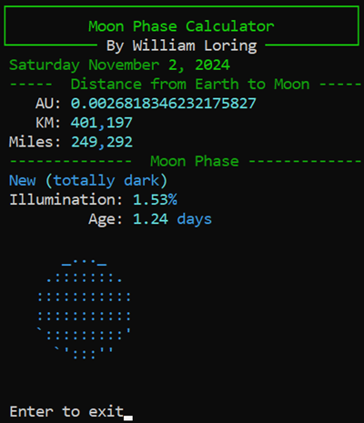
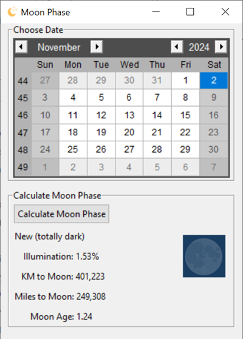

# Moon Phase App

Python CLI and Tkinter GUI programs to calculate moon phases and other moon data.

Batch files are included to use [Nuitka](https://pypi.org/project/Nuitka/) to convert the Python .py program to a Windows exe using GCC.

## Requirements

Uses the Python [ephem](https://pypi.org/project/ephem/) library.

- pip install ephem
- pip install geopy
- pip install tkcalendar
- pip install rich

## Version History

- (11/02/2024) Added moon age: number of days since the last new moon
- (10/26/2024) GUI images updated to Base64 for portable including in Nuita.
- (06/22/2024) CLI and GUI Updated to new Phase description calcuation to be more accurate
- (05/24/2024) Tkinter add Double Click on Calendar to show moon phase. Added rich console formatting to CLI.
- (10/20/2023) CLI Moon phase descriptions work
- (07/10/2023) Refactor to OOP. Move all ephem moon logic into moon_class.py
- (07/08/2023) Initial commit of CLI and GUI

### License

 

This work is licensed under a [Creative Commons Attribution-NonCommercial-ShareAlike 4.0 International License](http://creativecommons.org/licenses/by-nc-sa/4.0/)</a>.

Copyright (c) 2024 William A Loring